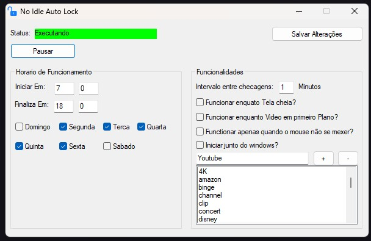
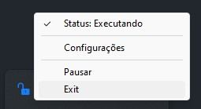

# No Idle Auto Lock

## Overview

No Idle Auto Lock is an AutoIt script designed to prevent your computer from going idle and locking itself. It intelligently monitors your computer's activity and takes action accordingly, allowing you to customize the behavior based on your preferences.

## Features

- **Smart Idle Detection:** The script monitors user activity and prevents the computer from going idle during specific hours.
- **Customizable Work Hours:** Define the hours during which the script should be active to suit your schedule.
- **Fullscreen and Video Playback Ignoring:** Configure the script to ignore fullscreen applications and video playback to avoid interruptions.
- **Mouse Movement Sensing:** Optionally, set the script to work only when the mouse is not actively moving.
- **Keyword-Based Video Detection:** Specify keywords that, when present in an active window title, indicate video playback.
- **Tray Icon Interface:** Conveniently control and monitor the script through the system tray icon.

## Installation

1. Download the latest release from the [Releases](https://github.com/medeiroz/no-idle-auto-lock/releases) page.
2. Extract the contents to a folder on your computer.

## Usage

1. Run the `NoIdleAutoLock.exe` executable.
2. The main interface will appear, allowing you to configure the script's settings.
3. Adjust the settings as needed and click "Save."
4. The script will run in the background, preventing your computer from going idle during specified hours.

## Screenshots

*Main Interface*

*Tray Icon Interface*

## Tray Icon Functionality

- **Status:** Displays the current status of the script.
- **Settings:** Opens the configuration interface.
- **Pause/Resume:** Pauses or resumes the functionality of the script.
- **Exit:** Closes the script.

## Contribution

Contributions are welcome! If you encounter issues or have suggestions, please open an [issue](https://github.com/medeiroz/no-idle-auto-lock/issues) or submit a [pull request](https://github.com/medeiroz/no-idle-auto-lock/pulls).

## License

This project is licensed under the MIT License - see the [LICENSE](LICENSE) file for details.

---

*No Idle Auto Lock is not affiliated with or endorsed by any third-party services mentioned in the keywords.*
